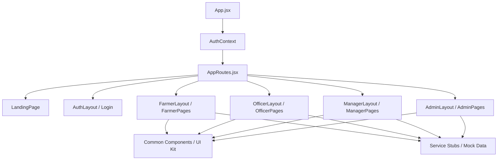

# 🏛️ Smart Procurement Portal - Architecture Specification

## Overview

The Smart Procurement Portal is architected to separate routing, layout presentation, state context, and mock API data services.

## Key Modules & Routes

- `/`: Landing Page
- `/login`: Role Login Selection
- `/farmer/*`: Farmer Dashboard, Book Slot, Token, Procurement Status, Payment Status, History, Help, Profile
- `/officer/*`: Officer Dashboard, Queue, Scan QR, Search Farmer, Weight Check, Quality Check, Submit Procurement, Receipt, History
- `/manager/*`: Manager Dashboard, Queue Monitoring, Slot Management, Officer Management, Reports, Issues, Analytics
- `/admin/*`: Admin Dashboard, State Analytics, District Analytics, Centre Monitoring, Payments, Reports, Users
